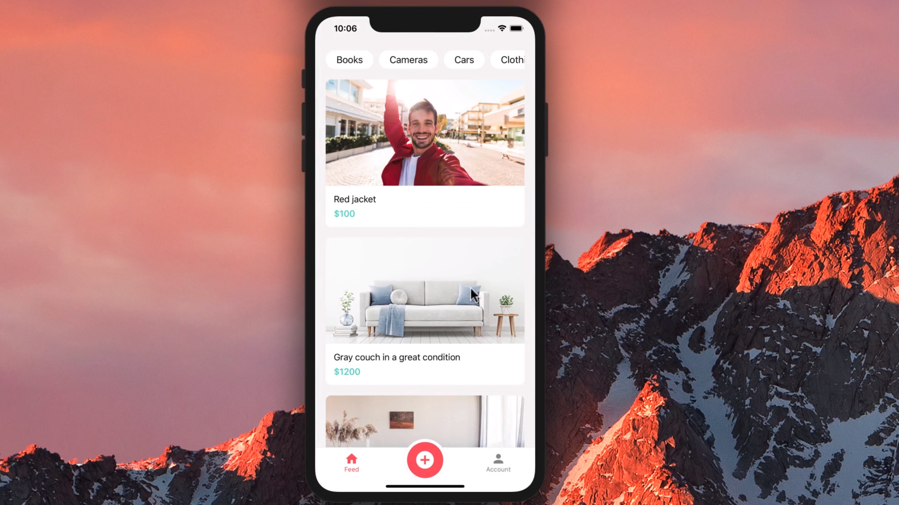

# Done With It

> A mobile app marketplace for selling the stuff you don't need anymore.

## Table of Contents

- [Technologies Used](#technologies-used)
- [Features](#features)
- [Screenshots](#screenshots)
- [Project Status](#project-status)
- [Contact](#contact)

## Technologies Used

- TypeScript
- React Native
- Expo
- Formik
- Yup

## Features

- User Authentication
- Users can create listings, view listings, and contact other users about listings they're interested in
- Users get push notifications when other users express interest in their listings

## Screenshots

## Project Status

Project is: _complete_.

## Contact

Created by [Peter Kibuchi](https://www.peterkibuchi.com/).
